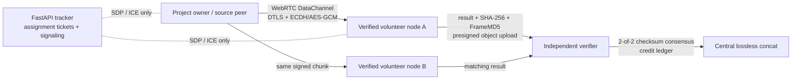

# Opt-in distributed rendering

The tracker never silently enrolls a browser. A node must send `consent.explicit_opt_in=true`, a stable Ed25519 public key, its capacity limits, and a signed heartbeat. Owners are never scheduled for their own projects, so a creator cannot self-award credits.

Each five-second output chunk contains an immutable, SHA-256-addressed timeline piece list and a deterministic software-FFmpeg contract. Two independent nodes must return the same binary SHA-256; the central verifier independently checks the uploaded object SHA-256, decoded `framemd5`, duration, signed result statement, and container image digest before awarding credits. Disagreement returns the chunk to the queue rather than accepting a majority of one.

4K/8K work is restricted to verified desktop nodes with the fixed rendering image digest. Browser nodes are deliberately restricted to small, explicitly opted-in jobs; they must not run while hidden/backgrounded. The WebRTC DataChannel is encrypted with DTLS, and the client protocol adds ephemeral ECDH/AES-GCM encryption plus 12 KiB fragments and backpressure.

After all chunks reach consensus, the tracker uses FFmpeg concat demuxing with `-c copy`, so final assembly is lossless and does not rerender the chunks. Cross-chunk effects, generative effects, and other non-deterministic timelines are rejected and continue on the centralized render path.
